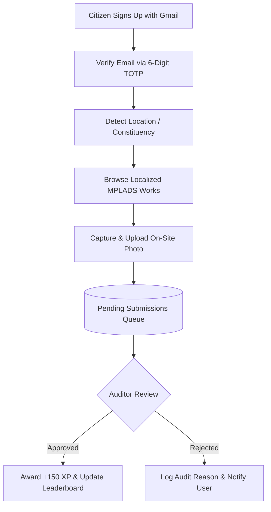
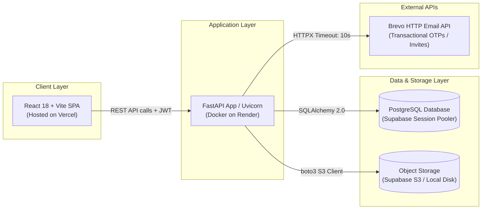

<div align="center">

# CivicQuest

**Citizen-Powered Verification & Public Accountability Portal for MPLADS Projects**

[](https://react.dev/)
[](https://vitejs.dev/)
[](https://tailwindcss.com/)
[](https://fastapi.tiangolo.com/)
[](https://www.python.org/)
[](https://www.postgresql.org/)
[](https://www.sqlite.org/)
[](https://supabase.com/)
[](https://vercel.com/)
[](https://render.com/)
[](https://www.docker.com/)

</div>

---

## 📖 What is CivicQuest?

**CivicQuest** bridges the gap between public development spending and ground-level reality across India. Under the Member of Parliament Local Area Development Scheme (MPLADS), thousands of civic works are sanctioned each year, yet citizens often lack visibility into what was built in their neighborhoods. CivicQuest empowers citizens to verify officially reported **Lok Sabha and Rajya Sabha development projects** by capturing and submitting geo-tagged photographic evidence directly from their mobile devices. Accredited regional auditors review the submissions to validate project completion, awarding gamified XP to citizens and maintaining an immutable public record of civic accountability.

---

## 🚀 Live Demo

<!-- TODO: Replace placeholder URL with your live production frontend deployment URL -->
🔗 **[Launch CivicQuest Web Portal](https://questcivic.vercel.app)** *(Deployed on Vercel & Render)*

---

## 📸 Screenshots

<!-- TODO: Add actual screenshot images to docs/screenshots/ as outlined below -->

| Citizen Experience | Auditor & Admin Experience |
| :---: | :---: |
| **Project Browser & Discovery**<br><br>*Explore localized MPLADS projects* | **Auditor Review Portal**<br><br>*Inspect photos in fullscreen & verify works* |
| **Citizen Authentication & OTP**<br><br>*Password & TOTP verification* | **Administrative Operations**<br><br>*Auditor delegation & immutable audit logs* |
| **Citizen Leaderboard**<br><br>*Rankings based on validated contributions* | **Citizen Profile & XP Tracking**<br><br>*Verification history & civic status* |

> Visual guides and expected screenshot formats are documented in [docs/screenshots/README.md](docs/screenshots/README.md).

---

## ✨ Features

### 🇮🇳 Citizen Features
- **Secure Authentication & Recovery**: Gmail-validated signup with 6-digit TOTP verification, strong password hashing (bcrypt), and rate-limited password reset flows.
- **Constituency Geo-Matching**: Automatic boundary detection via browser geolocation against Lok Sabha GeoJSON boundaries, with fallback to manual cascading selectors (State &rarr; District &rarr; Constituency).
- **MPLADS Works Explorer**: Browse completed Lok Sabha and Rajya Sabha development projects filtered to your home constituency, complete with sanction amounts, completion dates, and full-text search.
- **Camera-Driven Evidence Upload**: In-app camera integration (`capture="environment"`) with client-side preview, best-effort GPS tagging, and validation safeguards.
- **Civic Grievances & Complaints**: Report local infrastructure issues with photo evidence and detailed descriptions (capped at 3 active pending complaints).
- **Civic Gamification & XP**: Earn **+150 XP** for approved work verifications and **+50 XP** for accepted complaints.
- **Constituency Leaderboard**: Real-time civic ranking displaying verified citizen names and accumulated XP.
- **Citizen Profile**: View personalized submission history, complaint resolutions, and manage 30-day location change cooldowns.

### 🛡️ Auditor Features
- **Accredited Staff Login**: Invite-based onboarding via secure single-use email tokens, protected with 5-attempt rate limiters and lockout cooldowns.
- **Constituency-Scoped Queue**: Auditors view only submissions and complaints within their assigned geographical jurisdiction (built-in super-auditor views nationwide).
- **Fullscreen Image Inspection**: Built-in `PhotoViewer` component supporting high-resolution image analysis, keyboard shortcuts (`Esc`), and one-click photo downloads with preserved image headers.
- **One-Click Approvals & Structured Rejections**: Approve work evidence to instantly grant citizen XP, or reject with a mandatory constructive reason.
- **Complaint Adjudication**: Review citizen grievances, accept with **+50 XP** awards, or reject with feedback.
- **Performance Metrics**: Real-time review counters tracking pending, approved, and rejected volumes.

### 🏛️ Admin Features
- **Staff Administration**: Create and invite regional auditors by location, resend invitation tokens, or toggle auditor access status.
- **Immutable Audit Trail (`review_log`)**: Centralized log capturing every approval, acceptance, and rejection timestamped alongside the deciding auditor reference.
- **Cross-Constituency Oversight**: Filter and inspect all national work submissions and citizen complaints across any state or district.
- **System Telemetry & Summaries**: High-level aggregated statistics on total audited works and civic complaints.

---

## 🔄 How It Works

### Citizen Verification Flow



### System Architecture



---

## 🛠️ Tech Stack

| Layer | Technology | Purpose |
| :--- | :--- | :--- |
| **Frontend Framework** | React 18, Vite | High-performance single-page application |
| **Styling & UI** | Tailwind CSS 3 | Responsive design, modern aesthetics & accessible touch targets |
| **Routing & Client** | React Router 6, Axios | Client-side routing and authenticated API communication |
| **Backend Framework** | Python 3.11+, FastAPI, Uvicorn | High-throughput asynchronous REST API |
| **ORM & Database** | SQLAlchemy 2.0, PostgreSQL / SQLite | Data persistence, indexing, and connection pooling |
| **Security & Auth** | PyJWT, bcrypt, pyotp | JWT access tokens, salted password hashing, and TOTP generation |
| **Geo & Data Processing**| pandas, Shapely, RapidFuzz | CSV parsing, constituency boundary matching, and fuzzy search |
| **Media Handling** | Pillow, python-multipart | Image inspection, validation, and dimension verification |
| **Email Infrastructure** | Brevo v3 HTTP API / Resend / smtplib | Reliable transactional delivery bypassing cloud SMTP blocks |
| **Storage Abstraction**| boto3 (AWS S3 / Supabase S3) | Scalable object storage for uploaded civic photos |
| **Containerization** | Docker, Alpine/Slim base image | Containerized backend deployment |

---

## 📁 Project Structure

```text
CivicQuest/
├── backend/
│   ├── app/
│   │   ├── main.py              # Application entry point, CORS, and router registration
│   │   ├── config.py            # Pydantic Settings with production validation safeguards
│   │   ├── database.py          # SQLAlchemy engine, session maker, and pre-ping checks
│   │   ├── models.py            # Database schema models (User, Work, Submission, Complaint, etc.)
│   │   ├── schemas.py           # Pydantic request/response validation schemas
│   │   ├── security.py          # JWT issuance, password verification, and auth dependencies
│   │   ├── routers/             # API endpoints grouped by domain (auth, works, admin, auditor)
│   │   └── services/            # Core business logic (email dispatch, geo-matching, storage)
│   ├── data/                    # Lok Sabha constituency boundary GeoJSON and raw datasets
│   ├── scripts/                 # Utility scripts (CSV dataset ingestion, migrations)
│   ├── tests/                   # Pytest test suite (unit, integration, and security tests)
│   ├── Dockerfile               # Production container image definition
│   ├── requirements.txt         # Pinned Python package dependencies
│   └── .env.example             # Documented template for backend environment variables
├── frontend/
│   ├── src/
│   │   ├── components/          # Reusable UI widgets (PhotoViewer, WorkCard, Header, etc.)
│   │   ├── pages/               # Primary routed views (Works, Leaderboard, AuditorDashboard, etc.)
│   │   ├── api.js               # Axios HTTP client configured with JWT interceptors
│   │   └── App.jsx              # Application router and authentication context provider
│   ├── index.html               # Single page application HTML shell
│   ├── vite.config.js           # Vite development server and bundling configuration
│   ├── tailwind.config.js       # Tailwind CSS theme and styling rules
│   └── .env.example             # Frontend environment variables template
├── docs/
│   └── screenshots/             # Interface screenshots and documentation assets
├── Loksova.csv                  # Source MPLADS Lok Sabha dataset (read-only input)
├── RajyaSabha.csv               # Source MPLADS Rajya Sabha dataset (read-only input)
├── PRD.md                       # Core Product Requirements Document
├── PRD-v2.md                    # Supplemental specification & auditor photo viewer rules
└── README.md                    # Primary repository guide
```

---

## 💻 Getting Started Locally

### Prerequisites
- **Python**: Version `3.11` or higher
- **Node.js**: Version `18.0` or higher & `npm`
- **Git**

### 1. Clone the Repository
```bash
git clone https://github.com/YOUR-USERNAME/CivicQuest.git
cd CivicQuest
```

### 2. Backend Setup

```bash
cd backend

# Create and activate a virtual environment
# On Windows (PowerShell):
python -m venv venv
.\venv\Scripts\Activate.ps1

# On macOS/Linux:
python3 -m venv venv
source venv/bin/activate

# Install dependencies
pip install -r requirements.txt

# Configure environment variables
cp .env.example .env

# Import Lok Sabha and Rajya Sabha CSV datasets into SQLite
python -m scripts.import_csv

# Start the FastAPI development server
uvicorn app.main:app --reload --host 127.0.0.1 --port 8000
```
- **API Base**: `http://127.0.0.1:8000`
- **Interactive Swagger Docs**: `http://127.0.0.1:8000/docs`
- **Health Check**: `http://127.0.0.1:8000/health`

### 3. Frontend Setup

In a separate terminal window:
```bash
cd frontend

# Install node dependencies
npm install

# Configure environment variables
cp .env.example .env

# Launch Vite development server
npm run dev
```
Open **`http://localhost:5173`** in your browser.

### 4. Running Automated Tests

Run the backend test suite across all 100+ unit, integration, and security test cases:
```bash
cd backend
pytest -v
```

### 5. Running with Docker

You can also run the backend inside a Docker container:
```bash
cd backend
docker build -t civicquest-backend .
docker run -p 8000:8000 --env-file .env civicquest-backend
```

---

## ⚙️ Environment Variables

<details>
<summary><b>Click to view all configuration variables</b></summary>

### Backend (`backend/.env`)

| Variable | Required | Default / Placeholder | Description |
| :--- | :---: | :--- | :--- |
| `ENVIRONMENT` | Yes | `development` | Runtime mode: `development` or `production` |
| `SECRET_KEY` | Yes | `CHANGE_ME_SECRET_KEY_MIN_12_CHARS` | Secret key for signing JWT tokens (&ge; 12 chars in prod) |
| `DATABASE_URL` | Yes | `sqlite:///./app.db` | PostgreSQL connection URL or SQLite file path |
| `FRONTEND_ORIGIN` | Yes | `http://localhost:5173` | Allowed CORS origins (comma-separated for multiple domains) |
| `EMAIL_BACKEND` | Yes | `smtp` | Mail dispatcher: `smtp`, `brevo`, or `resend` |
| `EMAIL_API_KEY` | Cond. | `CHANGE_ME_EMAIL_API_KEY` | API key for Brevo (`xkeysib-...`) or Resend (`re_...`) |
| `EMAIL_FROM_ADDRESS`| Cond. | `CHANGE_ME_FROM_EMAIL@yourdomain.com` | Verified sender email for outgoing transactional messages |
| `EMAIL_FROM_NAME` | No | `CivicQuest` | Display name attached to outgoing emails |
| `SMTP_HOST` | Cond. | `smtp.gmail.com` | SMTP host (when `EMAIL_BACKEND=smtp`) |
| `SMTP_PORT` | Cond. | `587` | SMTP port |
| `SMTP_USER` | Cond. | `CHANGE_ME_SMTP_USER@gmail.com` | SMTP username (leaves in dev log mode if empty) |
| `SMTP_PASSWORD` | Cond. | `CHANGE_ME_SMTP_APP_PASSWORD` | SMTP password |
| `ALLOWED_EMAIL_DOMAIN`| No | `gmail.com` | Allowed email domain for citizen signups |
| `ADMIN_ID` | Yes | `civicquest-admin@gov.in` | Username/email for admin portal access |
| `ADMIN_PASSWORD` | Yes | `CHANGE_ME_ADMIN_PASSWORD_MIN_12_CHARS` | Password for admin portal access |
| `AUDITOR_ID` | Yes | `auditor` | Identifier for default built-in auditor |
| `AUDITOR_PASSWORD` | Yes | `CHANGE_ME_AUDITOR_PASSWORD_MIN_12_CHARS`| Password for default built-in auditor |
| `BUILTIN_AUDITOR_ENABLED`| No | `true` | Enable built-in auditor (forced `false` in prod unless explicit) |
| `STORAGE_BACKEND` | Yes | `local` | Storage provider: `local` (disk) or `s3` (cloud object store) |
| `S3_ENDPOINT_URL` | Cond. | `https://CHANGE_ME.supabase.co/storage/v1/s3` | S3 endpoint URL (required when `STORAGE_BACKEND=s3`) |
| `S3_BUCKET` | Cond. | `CHANGE_ME_BUCKET_NAME` | S3 bucket name |
| `S3_ACCESS_KEY_ID` | Cond. | `CHANGE_ME_S3_ACCESS_KEY_ID` | S3 access key |
| `S3_SECRET_ACCESS_KEY`| Cond.| `CHANGE_ME_S3_SECRET_ACCESS_KEY` | S3 secret key |
| `S3_REGION` | Cond. | `ap-south-1` | S3 geographic region |
| `S3_PUBLIC_BASE_URL`| Cond. | `https://CHANGE_ME.supabase.co/.../public` | Public URL prefix for uploaded media assets |
| `XP_PER_APPROVAL` | No | `150` | XP points awarded upon work approval |
| `XP_PER_COMPLAINT` | No | `50` | XP points awarded upon complaint acceptance |
| `MAX_PENDING_COMPLAINTS`|No | `3` | Maximum active pending complaints per citizen |
| `MAX_UPLOAD_MB` | No | `8` | Maximum image upload size in megabytes |
| `GEOJSON_PATH` | No | `data/lok_sabha_constituencies.geojson` | Path to GeoJSON boundary file |
| `INVITE_EXPIRE_HOURS`| No | `48` | Auditor invitation token lifespan in hours |
| `OTP_EXPIRE_MINUTES` | No | `5` | OTP code lifespan in minutes |
| `OTP_MAX_ATTEMPTS` | No | `5` | Maximum OTP verification failures before invalidation |
| `RESET_REQUESTS_PER_DAY`|No | `2` | Password reset requests permitted per email per day |
| `LOGIN_MAX_ATTEMPTS` | No | `5` | Login failure threshold before temporary lockout |
| `LOGIN_LOCK_MINUTES` | No | `15` | Account lockout duration after failed logins |
| `LOCATION_CHANGE_DAYS`| No | `30` | Minimum cooldown between citizen location edits (days) |

### Frontend (`frontend/.env`)

| Variable | Required | Default / Placeholder | Description |
| :--- | :---: | :--- | :--- |
| `VITE_API_URL` | Yes | `http://localhost:8000` | Backend API base URL without trailing slash |

</details>

> ⚠️ **Security Warning**: Never commit active `.env` files or credentials to Git. Store secrets securely in your cloud provider's environment settings.

---

## 🚢 Production Deployment

The project is architected for seamless cloud deployment:

- **Frontend (Vercel)**: Deployed as a single-page application with automatic Vite bundling. Set `VITE_API_URL` to your live backend endpoint.
- **Backend (Render)**: Deployed via Docker with the included `backend/Dockerfile`. Render handles automatic TLS termination and container restarts.
- **Database (Supabase PostgreSQL)**: Uses connection pooling (`pool_pre_ping=True`) with Supabase Session Pooler or direct PostgreSQL instances.
- **Storage (Supabase S3)**: Configured with `STORAGE_BACKEND=s3` for durable cloud storage of user-uploaded verification photos.
- **Email Delivery (Brevo HTTP API)**: Set `EMAIL_BACKEND=brevo` and provide `EMAIL_API_KEY` to send transactional OTPs and auditor invitations reliably over HTTPS, bypassing cloud provider SMTP port blocks (587/465).

---

## 🔒 Security & Integrity Safeguards

- **Hashed Credentials**: Passwords for citizens, auditors, and administrators are hashed using `bcrypt` with unique cryptographic salts.
- **Time-Based One-Time Passwords (TOTP)**: Email verification OTPs expire in 5 minutes and enforce a maximum of 5 verification attempts and hourly request limits.
- **Account Lockout Protection**: Staff auditor and admin logins trigger a 15-minute temporary lockout after 5 consecutive failed attempts.
- **Upload Validation & Inspection**: Uploaded images are checked against an 8MB size limit, inspected via Pillow for true image integrity, and stored with sanitized filenames.
- **Role-Based Access Control (RBAC)**: Distinct permissions for Citizens, Regional Auditors, and System Admins. Regional auditors are restricted to their geographic constituencies.
- **Transactional Rollback on Mail Failure**: During registration and password resets, database records are committed only after transactional emails dispatch successfully. If email delivery fails, the session rolls back to prevent orphaned accounts.
- **Strict Production Safeguards**: The application halts at startup if production mode is enabled with default or short secret keys.

---

## 🗺️ Roadmap

Based on feature extensions outlined in PRD-v2 and user feedback:

- [ ] **Auditor Photo Navigation**: Next/Previous keyboard shortcuts and carousel browsing within the fullscreen photo viewer.
- [ ] **Batch Audit Export**: Bulk ZIP download of verified evidence photos grouped by constituency and financial quarter.
- [ ] **Mobile Push Notifications**: Web Push / SMS alerts for citizens when submitted photos are approved or rejected.
- [ ] **Offline PWA Support**: Progressive Web App caching allowing citizens to capture verification photos in low-connectivity areas with background sync.
- [ ] **Geospatial Analytics Map**: Interactive constituency heatmap displaying project completion density and citizen participation metrics.
- [ ] **Citizen Achievement Badges**: Milestone badges (e.g., *"First Verification"*, *"Constituency Guardian"*) awarded for active civic auditing.

---

## 🤝 Contributing

Contributions are welcome! Please follow these steps:
1. Fork the repository.
2. Create a feature branch (`git checkout -b feature/civic-improvement`).
3. Commit your changes with clear commit messages.
4. Verify all tests pass (`pytest` in `backend/`).
5. Open a Pull Request detailing your changes and test coverage.

---

## 📄 License

<!-- TODO: Add official LICENSE file to root directory (e.g., MIT License or Apache 2.0) -->
This project is currently distributed for civic demonstration and academic evaluation. Please see the repository license or contact the maintainers for commercial use.

---

## 🙏 Acknowledgements & Data Sources

- **MPLADS Datasets**: Open data sourced from official **Lok Sabha** and **Rajya Sabha** Member of Parliament Local Area Development Scheme published records.
- **Constituency Boundaries**: GeoJSON spatial boundaries derived from open Indian parliamentary constituency datasets.
- Built for civic awareness, open governance, and transparent public accountability.
